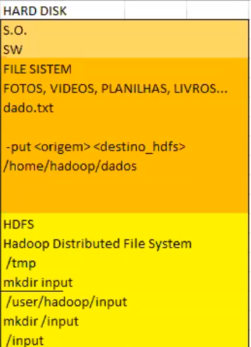

# Conceitos de Big Data

O termo Big Data se definiu em três caracteristicas: Velocidade, Volume e Variedade.

Com o tempo os V's do Big Data se expandiram e hoje em dia pode-se considerar 5: Velocidade, Volume, Variedade, Veracidade e Valor

- Volume: Conceito pode ser algo relativo, o que é uma volumetria expressiva hoje pode não ser amanhã.

- Velocidade: Em Big Date a tecnologia permite a análise de dados enquanto eles são gerados, por exemplo o streaming, que são muitas vezes analizados _in-memory_.

- Variedade: Aqui temos os __dados estruturados__ que são sistemas tradicionais, os __semi-estruturados__ (JSON ou XML) que normalmente são registros de sensores de máquinas ou logs, e __dados não-estruturados__ como email-s, mídias, vídeos, imagens e documentos eletronicos.

- Veracidade: Se trata de realizar o filtro sobre dados que vão de fato ser usados na análise.

- Valor: Nesse ponto temos a ideia de que ter acesso aos dados de Big Date é irrelevante a não ser que gere a partir deles valor ($$$);

## Hadoop

Haddop se resume a um framework em código aberto que permite o armazanamento (HDFS) e processamento (MapReduce) de dados de forma distribuída usando modelo simples de programação.

 - Vantagens: Código aberto, serviços em nuvem, escabilidade, foco na regra de negócio, hardware commodity (uso de máquinas e redes convencionais)

 - Desvantagens: Trabalhar com arquivos pequenos não compensa, problemas não paralizaveis.

### Arquitetura Hadoop


#### Armazenamento (HDFS)
Quando falamos do armazenamento Hadoop devemos lembrar que ele é distribuído, sendo assim ele possui uma arquitetura "Master->Slave".

> Obs: Slaves são a mesma coisa que nós.

No armazenamento temos sempre dois processos, um rodando no Master (__Namenode__) e outro no Slave (__Datanode__).

Quando um usuário entra com uma requisição de ingestão de dados no Master, o processo de __Namenode__ entra em ação. 

Esse processo tem como função criar uma lista, que armazena as informações de relação entre armazenamento dos blocos e máquinas do cluster. Sendo assim sempre que um bloco for realocado em uma Slave, isso fica registrado no Namenode.

>Obs: O namenode também garante que o sistema de arquivos esteja integro em caso de falhas.

Quando um bloco vai ser realocado da Master para a Slave, ele precisa passar pelo __YARN__, que é o responsável pela verificação de qual Slave está mais apta a receber esse bloco, verificando capacidade de armazenamento e processamento. Ao ser realocado o conjunto de blocos dentro das Slaves é chamado de __Datanode__.

>Obs: É importante ter um backup da Master em outra máquina, caso de problema na principal.

#### Processamento (MapReduce)
O processamento também é distribuído, na Master temos o processo chamado __Job Tracker__ e nas Slaves temos o __Task Tracker__.

Quando um usuário entra com uma requisição de processamento de dados no Master, o processo de __Job Tracker__ entra em ação. 

O __Job Tracker__ recebe a informação de qual o arquivo a ser acessado, e assim verifica no __Namenode__ em quais máquinas estão presentes os blocos deste arquivo.

Feito isso o __Job Tracker__ "negocia" com o __YARN__ para verificar qual máquina tem melhor disponibilidade no momento para processar essa requisição. Feita essa verificação ele da um push desse código de processamento apenas para as máquinas selecionadas pelo __YARN__.

Quem recebe esse push na máquina Slave é o processo de __Task Tracker__, que faz o processamento desses dados e retorna sua resposta ao __Job Tracker__ até a conclusão.

##### Entendendo o processamento
Quando nos aprofundamos no processamento dos dados vemos que ele é feito através de um MapReduce.

O __Map__ seria o responsável pela projeção e seleção. Como um SELECT..FROM..WHERE na linguagem SQL.

Já o __Reduce__ seria como um GROUP BY ou uma função como SUM(), AVG(), etc.

Quando isso acontece o __Map__ cria uma lista de chave/valor para cada bloco e depois realiza uma combinação, filtrando apenas chaves únicas e realizando assim o _SHUFFLE_, para garantir que não há repetição de chaves.

O _SHUFFLE_ consiste em redistribuir as chaves únicas obtidas na combinação e posteriormente cruzar a relação de chave/valor das listas de cada bloco, com as chaves únicas redistribuidas. 

Com isso temos o __Reduce__ destes dados já aplicando a função que foi solicitada pelo usuário.

Exemplo Shuffle:


##### Entendendo o armazenamento

Quando formatamos um HD para ser parte de um cluster Hadoop, ela particiona uma parte do FILE SYSTEM disponível. Essa parte então é chamada de HDFS (Haddop Distributed File System) que vai ser gerenciado pelo Hadoop.

Quando vamos fazer a ingestão de dados para o HDFS ele pode estar no próprio FILE SYSTEM ou em um armazenamento externo.

O comando usado no terminal para ingestão de dados é:
```
-put <origem> <destino_hdfs>
```



---

### HIVE

O HIVE veio com a função de facilitar a execução de comandos HDFS do Hadoop com uma abstração linguistica de SQL.

>Obs: O HIVE não é um SGBDR e também não deve ser usado como banco de dados.

Quando for utilizado um comando DDL no HIVE, ele cria no HDFS um diretório com o nome da tabela. E guarda também em um banco METASTORE as configurações dos atributos declarados. O caminho padrão da criação desse diretório é _"/user/hive/warehouse/tabela"_.

Caso seja necessário alterar o caminho de criação, pode-se usar o LOCATION na sintaxe, indicando o caminho a ser feito, caso o diretório já exista, ele apenas aponta como referência. 

> Para criar um diretório na raiz do HDFS basta utilizar a '/' antes do nome da tabela.

> Para facilitar a interação com o HIVE podemos utilizar o HUE, que permite a execução de códigos SQL e interação com o HDFS.

#### Comandos no HIVE

##### Carregando dados do FILE SYSTEM para o HDFS

Quando trabalhamos com o FILE SYSTEM o correto é utilizar o console para a execução do código. para trazer dados externos para o HDFS utilizamos o seguinte comando:
```
create table nome_tabela
(linha string);

load data local inpath '/caminho até o dado de origem' overwrite into table nome_tabela;
```

Feito isso, já se pode acessar os dados importados na HUE com o comando:
```
select * from nome_tabela;
```

>Se trocarmos o * por nomes de colunas, ele já executa o MapReduce.

##### Carregando conteúdo em um diretório

Quando já temos os dados no HDFS podemos carregar ele para um diretório específico utilizando o comando location e put.
```
create table nome_tabela
(linha string)
location '/diretório';

hadoop fs -put /origem do dado' /diretório;

select * from nome_tabela;
```

##### Cláusula EXTERNAL

A cláusula EXTERNAL é uma segurança a mais no sistema Hadoop, ela isola as ações que vão ser realizadas em execuções de código.

Por exemplo caso um drop seja realizado em uma table que não é externa, todos os dados serão apagados inclusive no HDFS.

Para criar uma table EXTERNAL seguimos o comando:
```
create EXTERNAL table nome_tabela
(linha string)
...;
```

##### Word Count
Para realizar uma função de _Word Count_ executamos o seguinte comando:
```
select palavras, count (*) as 'Repetições'
from (select explode(spli(linha, ' ') as palavras) from nome_tabela;)
```

#### Formantando arquivos
##### Formato SERDE
Um arquivo no formato SERDE é aquele no qual contamos as posições baseado nos bytes. Como na imagem abaixo:


Para este tipo de arquivo, usamos um guida de dados informando a quantidade de caracteres para cada campo e jogamos isso no código abaixo, sempre adaptando quando necessário:
```
create external table exxmplo_SERDE(
    conta string,
    nome string,
    tipo_pessoa string
    )
    row format SERDE
    'org.apache.hadoop.hive.contrib.serde2.RegexSerDe'
    with serdeproperties ('input.regex'='(.{5})(.{10})(.{2})')
    location '/tabela_posicional';
```